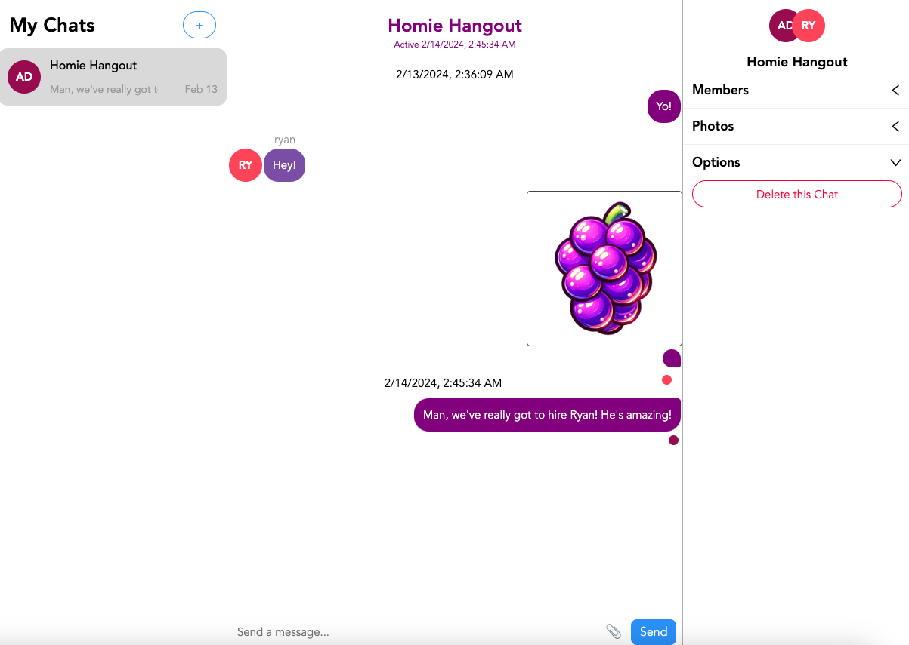

# Grapevine Chat App

### Description
Introducing Grapevine, the ultimate chat app for seamless communication and collaboration. With Grapevine, you can effortlessly create new chats or group chats, connect with friends, family, or colleagues, and conduct CRUD operations with ease. Share media, exchange ideas, and stay connected like never before. Plus, with Grapevine, your conversations persist even when you log out, ensuring you never miss a beat. Say goodbye to scattered conversations and hello to a unified, persistent chat experience with Grapevine.

### Table of Contents
- [Installation](#installation)
- [Screenshots](#screenshots)
- [Usage](#usage)
- [License](#license)
- [Contributing](#contributing)
- [Questions](#questions)

### Installation
To install Grapevine, simply clone the repository, navigate to the root directory, and run the following command:
```
npm install
```

### Screenshots




### Usage
To use Grapevine, simply navigate to the frontend folder in your terminal and run the following command:
```
npm run dev
```
Then, navigate to the backend folder in your terminal and run the following command:
```
npm run start
```
From there, you can create a new account, log in, and start chatting!

### License
This project is licensed under the MIT License.

### Contributing
Contributions are welcome! Please submit a pull request or open an issue if you would like to contribute to this project.

### Questions
If you have any questions about this project, please feel free to contact me at [ryanharrishtx@gmail.com](mailto:ryanharrishtx@gmail.com).